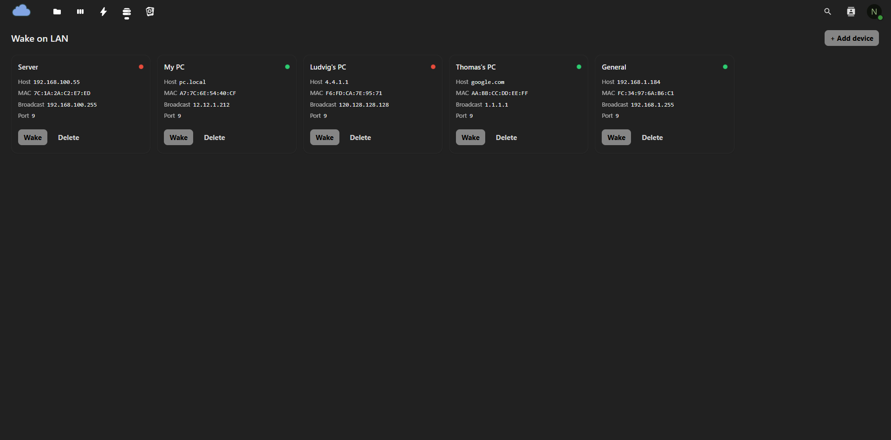
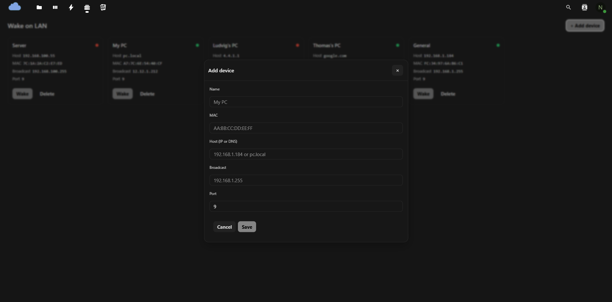

# Wake on LAN for Nextcloud (Beta)

[](LICENSE)
[](#)
[](#)
[](#)
[](https://github.com/FungY911/wakeonlan-nextcloud/issues)
[](https://github.com/FungY911/wakeonlan-nextcloud/pulls)
[](https://github.com/FungY911/wakeonlan-nextcloud/releases)

Wake your PCs and servers straight from Nextcloud.  
Add devices (name, MAC, host/IP, broadcast, port), send magic packets, and see live online/offline status (fping/TCP) with a modern UI.

---

## ✨ Features
- **Modern UI**: full-width device grid, modal forms, dark/light aware
- **Per-user devices** (each user manages their own list)
- **One-click Wake** (sends magic packet to broadcast:port)
- **Live status** green/red dot, **auto refresh every 5s**  
  Uses `fping` when available; falls back to TCP (445/3389/22)
- **CSRF-safe** endpoints; works behind reverse proxies

> `host/IP` is used for reachability checks; `broadcast:port` is used to send WOL.

---

## 📸 Screenshots

| Dashboard (devices) | Add device (modal) |
|---|---|
|  |  |

---

## ✅ Requirements
- Nextcloud **29+** (tested on NC 31.0.8)
- PHP sockets (standard in Nextcloud)
- Enabled exec in php-fpm
```bash
  sudo apt-get update && sudo apt-get install -y fping
  sudo setcap cap_net_raw+ep "$(command -v fping)"
```

---

## 🚀 Install
```bash
# On the Nextcloud server
cd /var/www/nextcloud/apps
git clone https://github.com/FungY911/wakeonlan-nextcloud.git wol

# permissions (adjust user/group as needed)
chown -R www-data:www-data wol

# enable the app (runs migrations)
sudo -u www-data php /var/www/nextcloud/occ app:enable wol
```
Open:
`https://<your-nextcloud>/apps/wol/app`

---
# 🧭 Usage
1. Add device → fill Name, MAC, Host/IP, Broadcast, Port (default 9)
2. Click Wake to send the magic packet
3. Watch the green/red status dot refresh every ~15s

---

# 🧪 Status checks (how it works)

Order of probes:

1. TCP connect to [445, 3389, 22] (works if ICMP is blocked)
2. fping (-a -t <ms>) when available

If you store hostnames, the app resolves them to IPs for consistent probing.

# 🔒 Security
- Uses Nextcloud CSRF tokens and app framework
- Devices are stored per user
- Compatible with HTTPS and typical reverse proxies

# 🛠 Troubleshooting

- Status always offline:
   - install + cap fping, or ensure one of 445/3389/22 is reachable when the device is up.
   - If it is a windows computer make sure that you have network profile on private network and not public (whitch is recommended, it is blocking ICMP pings by default)

- WOL doesn’t wake:
   - Enable WOL in BIOS/UEFI and NIC/OS
   - Verify broadcast address and port (often 9)
   - Some routers block directed broadcasts → use LAN broadcast
   - Make sure you have enabled "Wake up on magic packet"

- Computer is waking up unexpectly:
   - Make sure that you have disabled "Wake up on pattern match" (ICMP pings are waking up the compouter)
      - Windows:
          - Device Manager → Network Adapter → Properties → Power Management / Advanced
          - Disable “Wake on pattern match” / “Wake on ping”
          - Leave only “Wake on Magic Packet” enabled.
      - Linux:
          - Check WOL flags:
              ```bash
              ethtool eth0
              ```
          - Look for Wake-on: g → only magic packet.
          - If it says Wake-on: gpm → also wakes on packets/pings.
          - To set only magic packet:
              ```bash
              sudo ethtool -s eth0 wol g
              ```

# 🤝 Contributing
Issues and PRs welcome!
Please open an issue for discussion before larger changes.
